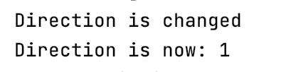

## Prerequisite

#### The following OS should be used for testing
- Mac OS X
- Linux
- Windows 7

#### Testing IDE
- IntelliJ IDEA CE
- Eclipse

#### Project JDK
- 9.0 Java Version "9.0.4"

---
## Project Setup
- git clone https://gitlab.engr.illinois.edu/ziningc2/sp21-cs242-assignment1.git

- cd sp21-cs242-assignment1

- Open the project in IntelliJ IDEA

- You should have a proper project structure looks like

- Right click "src/GUI/enterPlayerNum" and select "Run enterPlayerNum.main()"

- You should now have a window with to input enter player numbers

---
## Manual Tests

### Game Start
- Upon launching the game, you should be presented with a screen looks like this.

The user can input the number of players in the text box. 
After input a number, click the "Next" button to continue.

- After entering a number and click "Next", you should have a window looks like

The user can select the type of player for each. Including Human, Basic AI, and Strategic AI.
There's also a checkbox on the bottom right corner. If this box is checked,
the custom rule "Reverse On Black" would be applied to the game. 
After the type of each player is declared, click the "START" button and start the game.

### During the Game
- After "START" is clicked, current game state is shown in the screen.

To prevent the opponent sees the cards, all cards in hand are hided initially.
To see the cards in hand, click "Show"
  

- "Show" is clicked. The basic game scene for human player.

After "Show" is clicked, the cards in current player's hand is shown. 
This is the basic game scene, having color, number, symbol of the latest card from the discard pile.
There are also buttons to Hide, Skip, Draw Card, Change Color.
  - "Skip" is valid to click only if the previous player played a SkipCard. 
  - "Draw Card" is valid to click only if there's no valid card in hand.
  - "Change Color" is valid to click only if the previous player played a wild card
  

- If there is a valid card in hand, just click the card to play. 
  After clicking a valid card, the game continues to the next player.

- If the current turn is an AI player

The cards in the AI's hand will not be revealed. 
If the user click the "Next", the AI will automatically play his turn, 
and continue to the next player.
  

### Test skip cards
- If the previous player plays a SkipCard

The text "You are skipped. Please click the skip button" will show.
The current player needs to click "Skip" to skip the turn. 
Other buttons are not valid to click under this condition.
  
  
### Test no valid card in hand
- "Draw Card" is clicked
  
  If the current player has no valid card to play in hand. And if the previous card is not a +2/+4 card.
  The player needs to click "Draw Card", and one card will be drawn. It this card is valid to play,
  the card will be automatically played. After "OK" is clicked, the game continue to the next player.

### Test drawTwo cards
**_This rule and scene also applies to the stack of WildDrawFour cards._**
- If the previous player plays a DrawTwo Card

  The "Number of Cards to stack" would be added 2. 
  If the current player has a DrawTwoCard, he/she can play it to stack the cards.
  

- If the player stack another DrawTwo Card
  
  The "Number of Cards to stack" would be added another 2. Now there are 4 cards in stack.
  If the next player doesn't have a DrawTwoCard, he/she needs to draw certain number of cards.
  

- If the player doesn't have valid card to stack
  
  He/She can only click "Draw Card" to draw certain number of cards 
  according to the "Number of Cards to stack". 
  

- If the "OK" clicked.
  
  After drawing cards, the current player misses a turn.
  Game continues to the next player. 
  The "Number of Cards to stack" is reset to 0. 
  

### Test wild cards
- If the previous player plays a WildDrawFour or a WildCard

  A text "Please wait for the previous player to change color" will show. 
  The previous player needs to click the "Change Color" to select color.

### Test change color
- "Change Color" is clicked

  If a wild card is played. The player needs to change the color.
  "Change Color" is only valid to click after a wild card is played. 
  And it must be clicked to continue to the next player.
  

- After a color is chosen, and click "OK"

  The latest Card indicating the Wild card will now have color.
  The color shown is the color that the player selected.

### Test reverse cards
- If the previous player plays a ReverseCard
  
  From the "Current turn", we can see that the direction is reversed.
  The message will also be printed to the running output in IDE.
  
  
### Test game over
- If current player is the winner
  
  The current player has one card in hand and is valid to play.

- If the last one card is played
  
  After the only card is played out, the player becomes the winner. And the game is over.
  

- "Start a new game" is clicked
  
  A new game is started. The user can input number of players for the new game.